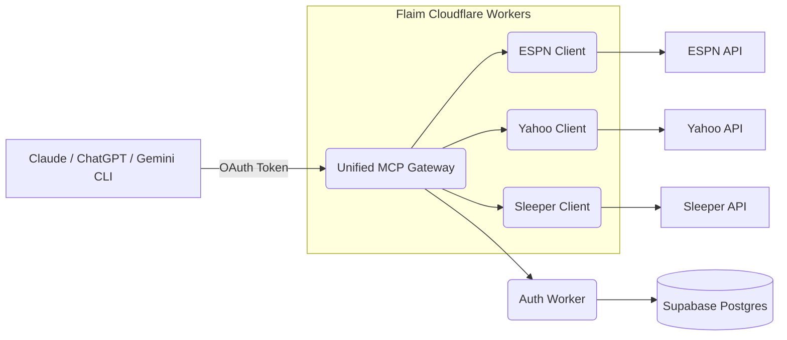

# Flaim

[](LICENSE)
[](https://api.flaim.app/mcp)
[](https://chromewebstore.google.com/detail/flaim-espn-fantasy-connec/mbnokejgglkfgkeeenolgdpcnfakpbkn)

Flaim connects your fantasy sports leagues (ESPN, Yahoo, Sleeper) to modern AI assistants like ChatGPT, Claude, and Gemini CLI.

Rather than building another walled-garden chatbot, Flaim provides the **data infrastructure and context** needed for general-purpose AIs to act as expert fantasy sports analysts for your specific team and matchup.

Read-only by design. No trades, no drops, no roster changes — just context and advice.

---

## What is Flaim?

To understand Flaim, it helps to break it into three core pieces:

1. **The Data Infrastructure (MCP Servers)**
   - Flaim provides a single, unified gateway for AI models to query real-time fantasy data across different platforms (ESPN, Yahoo, Sleeper) and sports (Football, Baseball, Basketball, Hockey).
   - It leverages the **Model Context Protocol (MCP)**, allowing an AI assistant to dynamically fetch rosters, standings, matchups, and waiver wires exactly when it needs them to answer a user's question.

2. **The "Analyst" Skill**
   - Raw data isn't enough; the AI needs to know *how* to use it.
   - Flaim includes an open-source "Skill" (instructions) that teaches the AI how to behave like a fantasy analyst. It tells the AI which MCP tools to call, how to interpret the numbers, and how to formulate actionable advice grounded in the user's specific league rules and roster constraints.

3. **The Web Hub & Authentication (BYOAI)**
   - Flaim uses a "Bring Your Own AI" (BYOAI) approach. The web app (flaim.app) acts as a secure configuration hub where users connect their fantasy platforms and select their default leagues.
   - We handle the complex authentication (ESPN cookies via an extension, Yahoo OAuth, Sleeper public APIs) and provide a standard OAuth 2.1 flow. Users simply connect their preferred AI (e.g., ChatGPT or Claude) to their Flaim account, granting the AI secure, scoped access to their fantasy data.

## How It Works

Flaim bridges the gap between private fantasy league data and external AI models.

### System Architecture

The project is built on a stable, "boring is better" tech stack emphasizing edge compute and low-maintenance infrastructure:

* **Web App (Next.js on Vercel):** Handles user onboarding, OAuth consent, league management, and provides specialized internal chat interfaces for debugging (`/dev`) and public demos (`/chat`).
* **Authentication Worker (Cloudflare Workers):** Manages user sessions, JWT verification, and securely stores/retrieves credentials via a Supabase Postgres database.
* **Unified MCP Gateway (Cloudflare Workers):** Acts as the single entry point for AI clients. It receives MCP tool requests and dynamically routes them to the correct platform-specific worker using internal service bindings.
* **Platform Clients (Cloudflare Workers):** Dedicated workers (`espn-client`, `yahoo-client`, `sleeper-client`) that handle the specific API quirks, data normalization, and request logic for each fantasy platform.



### The User Flow

1. **Onboarding:** A user signs up at [flaim.app](https://flaim.app).
2. **Connection:** They connect their leagues:
   - **ESPN:** Managed via a specialized Chrome Extension that seamlessly syncs session cookies.
   - **Yahoo:** Connected via standard OAuth.
   - **Sleeper:** Connected instantly via public username.
3. **Integration:** The user copies their Flaim MCP URL and adds it to their AI assistant's configuration.
4. **Execution:** When the user asks "Who should I start at Flex this week?", the AI queries Flaim via MCP, retrieves the user's live roster and matchup data, and generates a personalized recommendation.

## Why We Built It This Way

* **Decoupled AI Frontend:** By acting as a data provider (MCP) rather than a chat interface, Flaim remains agnostic to the rapid evolution of AI models. Users can bring their favorite, most capable model to the table.
* **Edge Performance:** Utilizing Cloudflare Workers ensures fast, distributed data fetching and reduces latency when the AI is making multiple tool calls in a single conversational turn.
* **Security & Isolation:** The architecture strictly separates the authentication layer from the data fetching layer, ensuring that sensitive credentials (like ESPN cookies) are securely stored and only accessed internally by the platform clients.
* **Modularity:** The unified gateway and separate platform clients make it straightforward to add support for new fantasy platforms or sports in the future.

---

## Development & Documentation

Flaim is a solo indie project built for long-term stability and utility.

```bash
git clone https://github.com/jdguggs10/flaim.git
cd flaim && npm install
cp web/.env.example web/.env.local  # add keys
npm run dev
```

### Key Resources

| Document | Description |
|----------|-------------|
| [Architecture](docs/ARCHITECTURE.md) | Deep dive into system design, OAuth flows, and infrastructure |
| [Web App](web/README.md) | Next.js routes, UI components, and chat surfaces |
| [Workers](workers/README.md) | Cloudflare Workers setup, unified gateway, and MCP tools |
| [Extension](extension/README.md) | Chrome extension build and sync mechanisms |
| [Changelog](docs/CHANGELOG.md) | Release history |

### Getting Help

- [GitHub Issues](https://github.com/jdguggs10/flaim/issues)
- [GitHub Discussions](https://github.com/jdguggs10/flaim/discussions)

## License

MIT License — see [LICENSE](LICENSE).
