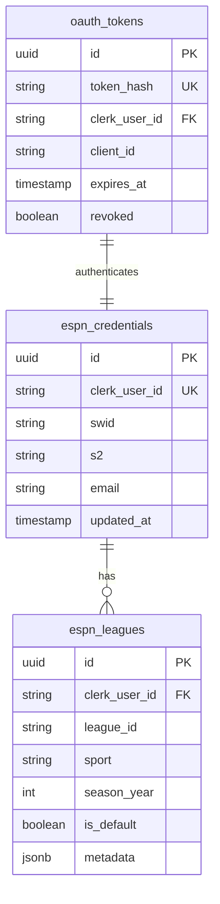

# Flaim Codebase Architectural Review

> **Author:** Claude Code (Architectural Review)
> **Date:** January 23, 2026
> **Branch:** `claude/codebase-review-gaps-b206d`

## Executive Summary

This document presents a comprehensive architectural review of the Flaim codebase, identifying critical gaps across security, testing, observability, code quality, and documentation. The analysis is based on thorough exploration of the codebase combined with industry best practices for MCP (Model Context Protocol) implementations, Cloudflare Workers, and TypeScript monorepos.

**Key Findings:**
- **Critical:** Testing coverage is at 4.5% with zero tests for OAuth flow and MCP tools
- **Critical:** Security gaps include missing authentication on an API endpoint and broad CORS wildcards
- **High:** Observability is minimal with no distributed tracing, error tracking, or alerting
- **High:** Significant code duplication across workers (~80% identical handler code)
- **Medium:** Inconsistent error handling patterns across 4+ different response formats

### Completed in Jan 2026 (Summary)

- Secured container file proxy (auth + input hardening), removed `X-User-Id` header leakage, randomized DCR client IDs.
- Tightened CORS allowlist; added CSRF origin checks for state‑changing `/api/*` requests.
- Added lightweight OAuth + MCP tool tests; marked testing as sufficient for current phase.
- Enabled traces + correlation IDs across the unified worker path; deferred structured logging/error tracking/alerting.
- Added `docs/DATABASE.md` and `docs/TESTING.md`; added basic security headers; added OAuth state validation and vector store upload size limit.

---

## Table of Contents

1. [Security Gaps](#1-security-gaps)
2. [Testing Deficiencies](#2-testing-deficiencies)
3. [Observability & Monitoring](#3-observability--monitoring)
4. [Code Quality Issues](#4-code-quality-issues)
5. [Error Handling Inconsistencies](#5-error-handling-inconsistencies)
6. [Documentation Gaps](#6-documentation-gaps)
7. [Architecture & Scalability](#7-architecture--scalability)
8. [Prioritized Remediation Plan](#8-prioritized-remediation-plan)
9. [References](#9-references)

---

## 1. Security Gaps

### 1.1 Critical: Missing Authentication on Container Files Endpoint

**Location:** `/web/app/api/chat/container_files/content/route.ts`

**Issue:** This endpoint proxies OpenAI container file content using the server API key without any authentication check. Any external actor could fetch arbitrary container files if they can guess IDs.

**Current Code (pre-fix):**
```typescript
export async function GET(request: Request) {
  const { searchParams } = new URL(request.url);
  const fileId = searchParams.get("file_id");
  const containerId = searchParams.get("container_id");
  // No authentication check
  const url = containerId
    ? `https://api.openai.com/v1/containers/${containerId}/files/${fileId}/content`
    : `https://api.openai.com/v1/container-files/${fileId}/content`;
  const response = await fetch(url, {
    headers: { Authorization: `Bearer ${process.env.OPENAI_API_KEY}` }
  });
}
```

**Proposed Fix:**
```typescript
import { auth } from '@clerk/nextjs/server';

export async function GET(request: Request) {
  const { userId } = await auth();
  if (!userId) {
    return NextResponse.json({ error: 'Unauthorized' }, { status: 401 });
  }
  // Proceed with authenticated request
}
```

**Defense:** Authentication is a fundamental security control. Without it, any external actor can invoke this endpoint. The June 2025 MCP specification updates explicitly require that "authorization MUST be included in every HTTP request" ([MCP Authorization Spec](https://modelcontextprotocol.io/specification/2025-03-26/basic/authorization)).

**Status (2026-01-23):** Fixed — added Clerk auth check, encoded IDs, and sanitized/quoted filename in `Content-Disposition`.

---

### 1.2 High: User ID Exposed in Response Headers

**Location:** `/workers/auth-worker/src/index-hono.ts:726`

**Issue:** The `X-User-Id` header exposes Clerk user IDs in API responses, which could be used for user enumeration attacks.

**Current Code:**
```typescript
return new Response(JSON.stringify({ ... }), {
  headers: {
    'X-User-Id': clerkUserId,  // Exposed
    'X-RateLimit-Limit': String(RATE_LIMIT_PER_DAY),
    ...corsHeaders
  }
});
```

**Proposed Fix:**
Remove the `X-User-Id` header entirely, or if needed for debugging, mask it:
```typescript
'X-User-Id': maskUserId(clerkUserId),  // Returns "user_***abc"
```

**Defense:** User IDs, even opaque ones, should not be exposed in response headers. They can be correlated with other data leaks to build user profiles. The principle of least privilege applies to information disclosure.

**Status (2026-01-23):** Fixed — removed `X-User-Id` from auth-worker responses.

---

### 1.3 High: Deterministic OAuth Client ID Generation

**Location:** `/workers/auth-worker/src/oauth-handlers.ts:253-256`

**Issue:** Dynamic Client Registration generates client IDs deterministically from `software_id` or `redirect_uri`. An attacker who knows the pattern can pre-register and impersonate legitimate clients.

**Current Code:**
```typescript
const clientId = software_id
  ? `mcp-${software_id}`
  : `mcp-${encodeURIComponent(redirect_uri)}`;
```

**Proposed Fix:**
Use cryptographically random client IDs:
```typescript
const clientId = `mcp-${crypto.randomUUID()}`;
```

**Defense:** RFC 7591 (Dynamic Client Registration) recommends that client identifiers be unique and unpredictable. Deterministic generation creates a collision risk and allows client impersonation ([RFC 7591 Section 3.2.1](https://datatracker.ietf.org/doc/html/rfc7591#section-3.2.1)).

**Status (2026-01-23):** Fixed — generate `client_id` with `crypto.randomUUID()` instead of hashing `software_id`/`redirect_uri`.

---

### 1.4 Medium: Broad CORS Wildcard Configuration

**Location:** `/workers/shared/src/cors.ts:13`

**Issue:** The CORS configuration allows `https://*.vercel.app`, which permits ANY Vercel deployment (including attacker-controlled) to make authenticated requests.

**Current Code:**
```typescript
const ALLOWED_ORIGINS = [
  'https://*.vercel.app',  // Too broad
  'https://flaim.app',
  // ...
];
```

**Proposed Fix:**
Restrict to Flaim preview/production Vercel domains:
```typescript
const ALLOWED_ORIGINS = [
  'https://flaim-*.vercel.app',  // Preview deployments
  'https://flaim.vercel.app',    // Vercel production domain
  'https://flaim.app',
  'https://www.flaim.app',
];
```

**Defense:** CORS wildcards are a common attack vector. An attacker can deploy a malicious site on Vercel and make cross-origin requests to Flaim APIs. The fix restricts to only legitimate preview deployments matching the Flaim naming pattern.

**Status (2026-01-23):** Fixed — replaced `https://*.vercel.app` with `https://flaim-*.vercel.app` and added `https://flaim.vercel.app`.

---

### 1.5 Medium: Missing CSRF Token Validation

**Location:** Multiple POST endpoints in `/web/app/api/`

**Issue:** State-changing POST endpoints lack CSRF token validation, relying solely on SameSite cookie policies which have browser compatibility gaps.

**Proposed Fix:**
Implement CSRF tokens using Next.js middleware or a library like `csrf`:
```typescript
import { verifyCsrfToken } from '@/lib/csrf';

export async function POST(request: Request) {
  const csrfToken = request.headers.get('X-CSRF-Token');
  if (!verifyCsrfToken(csrfToken)) {
    return NextResponse.json({ error: 'Invalid CSRF token' }, { status: 403 });
  }
  // ...
}
```

**Defense:** Defense-in-depth requires multiple layers of CSRF protection. SameSite cookies help but are not sufficient alone, especially for older browsers or when cookies need cross-site access.

**Status (2026-01-23):** Mitigated — added origin/referer allowlist checks for state‑changing `/api/*` requests in `web/middleware.ts` (skips extension bearer‑token routes).

---

### 1.6 Additional Security Recommendations

| Issue | Severity | Recommendation |
|-------|----------|----------------|
| No CSP headers | Medium | Add `Content-Security-Policy` in `next.config.mjs` |
| Missing security headers | Medium | Add `X-Content-Type-Options: nosniff`, `X-Frame-Options: DENY` |
| File upload without size limits | Low | Add `maxFileSize` validation in upload endpoints |
| State parameter not server-validated | Medium | Store and verify OAuth state server-side |

**Status (2026-01-23):** Partially addressed — added `X-Content-Type-Options: nosniff` and `X-Frame-Options: DENY` via `web/next.config.mjs`; added OAuth state storage/validation; added file upload size limit for vector store uploads. CSP still deferred.

---

## 2. Testing Deficiencies

### 2.1 Critical: Overall Coverage Statistics

| Category | Source Files | Test Files | Coverage |
|----------|--------------|------------|----------|
| **Auth-Worker** | 12 | 4 | 33% (files) |
| **Fantasy-MCP** | 5 | 2 | 40% (files) |
| **ESPN-Client** | 8 | 1 | 12.5% (files) |
| **Baseball-MCP** | 8 | 0 | **0%** |
| **Football-MCP** | 6 | 0 | **0%** |
| **Extension** | 9 | 0 | **0%** |
| **Web App** | 114 | 0 | **0%** |
| **TOTAL** | **174** | **8** | **4.5%** |

The 4.5% file coverage is critically low. Industry standards recommend 70-80% code coverage for production systems.

---

### 2.2 Critical: Zero Tests for OAuth 2.1 Flow

**Gap:** The entire 787-line OAuth implementation has no automated tests.

**Untested Critical Paths:**
- Authorization endpoint redirect validation
- PKCE challenge/verifier verification (S256 and plain methods)
- Authorization code exchange
- Token refresh flow
- Token revocation
- Dynamic Client Registration (RFC 7591)
- Protected Resource Metadata (RFC 9728)

**Proposed Fix:** Create comprehensive OAuth integration tests:

```typescript
// workers/auth-worker/src/__tests__/oauth-flow.test.ts
describe('OAuth 2.1 Flow', () => {
  describe('Authorization Code Flow with PKCE', () => {
    it('should generate authorization code with valid PKCE challenge', async () => {
      const codeVerifier = generateCodeVerifier();
      const codeChallenge = await generateS256Challenge(codeVerifier);

      const response = await handleAuthorize({
        response_type: 'code',
        client_id: 'test-client',
        redirect_uri: 'http://localhost:3000/callback',
        code_challenge: codeChallenge,
        code_challenge_method: 'S256',
        state: 'test-state'
      });

      expect(response.status).toBe(302);
      expect(response.headers.get('Location')).toContain('code=');
    });

    it('should reject token exchange with invalid code_verifier', async () => {
      // ... test PKCE verification
    });

    it('should reject reused authorization codes', async () => {
      // ... test one-time use
    });
  });
});
```

**Defense:** The June 2025 MCP specification mandates OAuth 2.1 with PKCE for all client types ([MCP Auth Spec](https://modelcontextprotocol.io/specification/2025-03-26/basic/authorization)). Without tests, PKCE verification bugs could allow token theft via code interception attacks.

**Status (2026-01-23):** Sufficient for current phase — added unit tests for DCR client_id uniqueness, /authorize PKCE/redirect_uri validation, and /token exchange success + invalid_grant (auth-worker). Defer full integration flow until real users/traffic.

---

### 2.3 Critical: Zero Tests for MCP Tools

**Gap:** None of the ~20 MCP tools have automated tests.

**Untested Tools:**
- `get_user_session` - League discovery
- `get_league_info` - League metadata
- `get_standings` - Standings calculation
- `get_matchups` - Week matchups
- `get_roster` - Team roster with player stats
- `get_free_agents` - Available players

**Proposed Fix:** Add tool-specific tests:

```typescript
// workers/fantasy-mcp/src/__tests__/tools.test.ts
describe('MCP Tools', () => {
  describe('get_league_info', () => {
    it('should return league settings for valid league_id', async () => {
      const result = await handleGetLeagueInfo({
        platform: 'espn',
        sport: 'football',
        league_id: '12345',
        season_year: 2025
      }, mockCredentials);

      expect(result.success).toBe(true);
      expect(result.data.settings).toBeDefined();
    });

    it('should handle 404 for non-existent league', async () => {
      const result = await handleGetLeagueInfo({
        platform: 'espn',
        sport: 'football',
        league_id: 'nonexistent',
        season_year: 2025
      }, mockCredentials);

      expect(result.success).toBe(false);
      expect(result.error).toContain('not found');
    });
  });
});
```

**Defense:** MCP tools are the primary interface for AI agents. Untested tools could return incorrect data that AI models would propagate to users, causing incorrect fantasy sports decisions.

**Status (2026-01-23):** Sufficient for current phase — added minimal tests for unified tool set, get_user_session auth/empty behavior, and get_league_info routing success (fantasy-mcp). Expand only if tool logic changes.

---

### 2.4 High: No Integration Tests

**Gap:** No tests verify end-to-end flows across workers.

**Proposed Fix:** Add integration tests using Miniflare:

```typescript
// workers/__tests__/integration/full-flow.test.ts
describe('Integration: OAuth to MCP Call', () => {
  it('should complete full auth flow and make MCP call', async () => {
    // 1. Dynamic Client Registration
    const client = await registerClient();

    // 2. Authorization Flow with PKCE
    const authCode = await authorize(client);

    // 3. Token Exchange
    const tokens = await exchangeCode(authCode);

    // 4. MCP Tool Call
    const result = await callMcpTool('get_league_info', tokens.access_token);

    expect(result.success).toBe(true);
  });
});
```

---

### 2.5 High: No E2E Tests for Extension

**Gap:** The Chrome extension has zero automated tests despite being a critical user acquisition channel.

**Proposed Fix:** Add Playwright extension testing:

```typescript
// extension/__tests__/e2e/sync-flow.spec.ts
import { test, expect, chromium } from '@playwright/test';

test('extension syncs ESPN credentials', async () => {
  const context = await chromium.launchPersistentContext('', {
    headless: false,
    args: [`--load-extension=${extensionPath}`]
  });

  // Navigate to ESPN and verify cookies are detected
  const page = await context.newPage();
  await page.goto('https://www.espn.com/fantasy/');

  // Open extension popup
  const popup = await openExtensionPopup(context);
  await popup.click('[data-testid="sync-button"]');

  // Verify sync success
  await expect(popup.locator('[data-testid="sync-status"]')).toContainText('Synced');
});
```

---

### 2.6 Testing Priority Matrix

| Test Type | Priority | Effort | Impact |
|-----------|----------|--------|--------|
| OAuth Flow Integration | P0 | High | Critical |
| MCP Tools Unit Tests | P0 | Medium | Critical |
| PKCE Verification | P0 | Low | Critical |
| ESPN API Error Paths | P1 | Medium | High |
| Extension E2E | P1 | High | High |
| Web App Components | P2 | High | Medium |
| Load/Performance | P2 | Medium | Medium |

---

## 3. Observability & Monitoring

### 3.1 Current State

| Capability | Status | Notes |
|------------|--------|-------|
| Log Persistence | Partial | Cloudflare Workers Logs, 100% sampling |
| Structured Logging | None | `console.log()` only, no JSON |
| Metrics | Minimal | Rate limiting counters only |
| Error Tracking | None | No Sentry/Datadog |
| Distributed Tracing | Disabled | Traces disabled in wrangler.jsonc |
| Health Checks | Good | All workers have `/health` endpoints |
| Alerting | None | No automated notifications |
| Dashboards | None | Manual log review only |

---

### 3.2 Critical: No Distributed Tracing

**Issue:** Requests flow through multiple workers (fantasy-mcp → espn-client → auth-worker → ESPN API) but there's no way to trace a request across services.

**Current Configuration:**
```jsonc
// wrangler.jsonc
"traces": {
  "enabled": false  // Disabled!
}
```

**Proposed Fix:**

1. Enable traces in all wrangler.jsonc files:
```jsonc
"traces": {
  "enabled": true,
  "persist": true,
  "head_sampling_rate": 0.1  // 10% in prod, 1.0 in dev
}
```

2. Implement correlation IDs:
```typescript
// workers/shared/src/tracing.ts
export function getCorrelationId(request: Request): string {
  return request.headers.get('X-Correlation-ID')
    ?? request.headers.get('CF-Ray')
    ?? crypto.randomUUID();
}

export function propagateCorrelationId(correlationId: string): Headers {
  return new Headers({ 'X-Correlation-ID': correlationId });
}
```

3. Add to all fetch calls:
```typescript
const response = await fetch(url, {
  headers: {
    ...existingHeaders,
    'X-Correlation-ID': correlationId
  }
});
```

**Defense:** Cloudflare's [observability documentation](https://developers.cloudflare.com/workers/observability/) emphasizes that distributed tracing is essential for debugging production issues in multi-worker architectures. Without it, correlating logs across services requires manual timestamp matching.

**Status (2026-01-23):** Partially addressed — enabled traces (100% sampling for now) in all workers and added correlation ID propagation between fantasy-mcp → espn-client → auth-worker, with `X-Correlation-ID` returned to callers.

---

### 3.3 High: No Structured Logging

**Issue:** Logs use `console.log()` with emoji prefixes, making them difficult to query and aggregate.

**Current Pattern:**
```typescript
console.log('🏈 [sdk-agent] Fetching leagues...');
console.log(`✅ Successfully retrieved ${sport} league info`);
```

**Proposed Fix:** Implement structured JSON logging:

```typescript
// workers/shared/src/logger.ts
interface LogEntry {
  timestamp: string;
  level: 'debug' | 'info' | 'warn' | 'error';
  service: string;
  correlationId?: string;
  userId?: string;
  message: string;
  context?: Record<string, unknown>;
}

export function createLogger(service: string, correlationId?: string) {
  return {
    info(message: string, context?: Record<string, unknown>) {
      console.log(JSON.stringify({
        timestamp: new Date().toISOString(),
        level: 'info',
        service,
        correlationId,
        message,
        context
      }));
    },
    error(message: string, error?: Error, context?: Record<string, unknown>) {
      console.error(JSON.stringify({
        timestamp: new Date().toISOString(),
        level: 'error',
        service,
        correlationId,
        message,
        error: error?.message,
        stack: error?.stack,
        context
      }));
    }
  };
}

// Usage
const logger = createLogger('auth-worker', correlationId);
logger.info('Fetching credentials', { userId: maskUserId(userId) });
```

**Defense:** Cloudflare's Workers Logs [automatically extracts JSON fields](https://developers.cloudflare.com/workers/observability/logs/workers-logs/) for filtering in the dashboard. Structured logs enable queries like "show all errors for service=auth-worker in the last hour."

**Status (2026-01-23):** Deferred — current traffic is near zero; revisit when usage grows or debugging becomes painful.

---

### 3.4 High: No Error Tracking Service

**Issue:** Errors are logged to console but not aggregated, deduplicated, or alerted on.

**Proposed Fix:** Integrate Sentry for Cloudflare Workers:

```typescript
// workers/shared/src/sentry.ts
import * as Sentry from '@sentry/cloudflare';

export function initSentry(env: { SENTRY_DSN?: string }) {
  if (env.SENTRY_DSN) {
    Sentry.init({
      dsn: env.SENTRY_DSN,
      environment: env.ENVIRONMENT,
      tracesSampleRate: 0.1,
    });
  }
}

export function captureException(error: Error, context?: Record<string, unknown>) {
  Sentry.captureException(error, { extra: context });
}

// Usage in error handler
api.onError((err, c) => {
  captureException(err, {
    path: c.req.path,
    method: c.req.method
  });
  // ... return error response
});
```

**Defense:** Error tracking services provide deduplication, stack trace grouping, and alerting. This is essential for catching regressions before users report them.

**Status (2026-01-23):** Deferred — not needed until real user traffic or repeated error triage.

---

### 3.5 Medium: No Alerting Configuration

**Proposed Fix:** Set up alerting for critical failures:

1. **Uptime Monitoring:** Use Cloudflare Health Checks or Uptime Robot
2. **Error Rate Alerts:** Configure Sentry alert rules for error spikes
3. **Rate Limit Alerts:** Add Supabase trigger for rate limit exhaustion
4. **Slack/PagerDuty Integration:** Route critical alerts to on-call

```sql
-- Supabase function for rate limit alerts
CREATE OR REPLACE FUNCTION notify_rate_limit_exhausted()
RETURNS trigger AS $$
BEGIN
  IF NEW.count >= 200 THEN
    PERFORM net.http_post(
      'https://hooks.slack.com/services/...',
      '{"text": "Rate limit exhausted for user"}',
      'application/json'
    );
  END IF;
  RETURN NEW;
END;
$$ LANGUAGE plpgsql;
```

**Status (2026-01-23):** Deferred — no active user traffic; add basic uptime checks when usage grows.

---

## 4. Code Quality Issues

### 4.1 Critical: Massive Code Duplication

**Issue:** ~80% of handler code is duplicated between football and baseball workers.

**Examples:**
| File | Lines | Duplicate In |
|------|-------|--------------|
| `football/handlers.ts` | 428 | `baseball/handlers.ts` (451 lines) |
| `football-espn-mcp/index-hono.ts` | 863 | `baseball-espn-mcp/index-hono.ts` (846 lines) |
| `football-espn-mcp/sdk-agent.ts` | 1043 | `baseball-espn-mcp/sdk-agent.ts` (similar) |

**Proposed Fix:** Extract shared code to `@flaim/worker-shared`:

```typescript
// workers/shared/src/handlers/base-handler.ts
export abstract class BaseSportHandler {
  constructor(
    protected sport: Sport,
    protected credentials: EspnCredentials,
    protected logger: Logger
  ) {}

  async getLeagueInfo(leagueId: string, seasonYear: number) {
    const url = this.buildLeagueUrl(leagueId, seasonYear);
    return this.fetchWithAuth(url);
  }

  abstract buildLeagueUrl(leagueId: string, seasonYear: number): string;
  abstract parseResponse(data: unknown): LeagueInfo;
}

// workers/espn-client/src/sports/football/handler.ts
export class FootballHandler extends BaseSportHandler {
  buildLeagueUrl(leagueId: string, seasonYear: number) {
    return `https://lm-api-reads.fantasy.espn.com/apis/v3/games/ffl/seasons/${seasonYear}/segments/0/leagues/${leagueId}`;
  }
}
```

**Defense:** Code duplication violates DRY (Don't Repeat Yourself) and creates maintenance burden. Bugs fixed in one file must be fixed in all copies. Monorepo best practices emphasize [sharing code through internal packages](https://monorepo.tools/typescript) rather than copy-paste.

---

### 4.2 High: Large Files Need Refactoring

| File | Lines | Issue | Proposed Split |
|------|-------|-------|----------------|
| `auth-worker/index-hono.ts` | 1155 | 76 conditionals, mixed concerns | `routes/`, `handlers/`, `middleware/` |
| `oauth-handlers.ts` | 786 | Multiple OAuth flows | `oauth/authorize.ts`, `oauth/token.ts`, `oauth/register.ts` |
| `supabase-storage.ts` | 739 | Credentials + Leagues + OAuth | `storage/credentials.ts`, `storage/leagues.ts`, `storage/oauth.ts` |
| `baseball-espn-mcp/sdk-agent.ts` | 1043 | Tool definitions + handlers | `tools/definitions.ts`, `tools/handlers/` |

**Proposed Refactoring for auth-worker:**

```
workers/auth-worker/src/
├── index.ts                    # Main entry, app setup
├── routes/
│   ├── credentials.ts          # /credentials/* routes
│   ├── oauth.ts                # /authorize, /token, /revoke
│   ├── extension.ts            # /api/extension/* routes
│   └── health.ts               # /health route
├── handlers/
│   ├── credentials-handler.ts
│   ├── oauth-handler.ts
│   └── extension-handler.ts
├── storage/
│   ├── credentials-storage.ts
│   ├── oauth-storage.ts
│   └── league-storage.ts
├── middleware/
│   ├── auth.ts                 # JWT verification
│   ├── cors.ts                 # CORS handling
│   └── rate-limit.ts           # Rate limiting
└── types/
    └── index.ts
```

---

### 4.3 High: Type Safety Issues

**Issue:** 17+ instances of `as any` type assertions bypass TypeScript's safety.

**Problematic Patterns:**
```typescript
// workers/espn-client/src/sports/football/handlers.ts:48
const data = await response.json() as any;

// workers/football-espn-mcp/src/index-hono.ts:779
(body as any).tool
```

**Proposed Fix:** Create proper ESPN response types:

```typescript
// workers/espn-client/src/types/espn-responses.ts
export interface EspnLeagueResponse {
  id: number;
  settings: {
    name: string;
    // ... properly typed fields
  };
  teams: EspnTeam[];
  members: EspnMember[];
}

// Type guard for runtime validation
export function isEspnLeagueResponse(data: unknown): data is EspnLeagueResponse {
  return (
    typeof data === 'object' &&
    data !== null &&
    'id' in data &&
    'settings' in data
  );
}

// Usage
const data = await response.json();
if (!isEspnLeagueResponse(data)) {
  throw new Error('Invalid ESPN API response');
}
// data is now properly typed
```

**Defense:** Type assertions (`as any`) tell TypeScript to trust the developer blindly. This defeats the purpose of TypeScript and allows runtime type errors. ESPN's undocumented API responses should be validated at runtime with type guards.

---

### 4.4 Medium: Magic Numbers & Strings

**Issue:** Hardcoded values scattered across files without explanation.

**Examples:**
```typescript
// Timeout values
5000  // in sdk-agent.ts (3 files)
7000  // in basic-league-info.ts (2 files)

// Season constants
const MIN_YEAR = 2000;
const MAX_CONSECUTIVE_MISSES = 2;
const PROBE_DELAY_MS = 200;

// User ID masking
if (!userId || userId.length <= 8)  // Why 8?
```

**Proposed Fix:** Create a constants file:

```typescript
// workers/shared/src/constants.ts
export const TIMEOUTS = {
  ESPN_API: 7000,
  AUTH_WORKER: 5000,
  SERVICE_BINDING: 3000
} as const;

export const SEASON_DISCOVERY = {
  MIN_YEAR: 2000,
  MAX_CONSECUTIVE_MISSES: 2,
  PROBE_DELAY_MS: 200
} as const;

export const RATE_LIMITS = {
  MCP_CALLS_PER_DAY: 200,
  MAX_LEAGUES_PER_USER: 10
} as const;

export const USER_ID_MASK_THRESHOLD = 8;
```

---

## 5. Error Handling Inconsistencies

### 5.1 High: Multiple Error Response Formats

**Issue:** The codebase uses 4+ different error response formats:

**Format 1: OAuth-style**
```json
{ "error": "invalid_grant", "error_description": "Code expired" }
```

**Format 2: Simple message**
```json
{ "error": "Failed to fetch leagues" }
```

**Format 3: Success flag with error**
```json
{ "success": false, "error": "League not found", "code": "NOT_FOUND" }
```

**Format 4: Internal worker format**
```json
{ "error": "Invalid credentials", "message": "SWID format invalid" }
```

**Proposed Fix:** Standardize on RFC 7807 Problem Details:

```typescript
// workers/shared/src/errors.ts
export interface ProblemDetails {
  type: string;        // URI reference identifying error type
  title: string;       // Human-readable summary
  status: number;      // HTTP status code
  detail?: string;     // Human-readable explanation
  instance?: string;   // URI reference to specific occurrence
  [key: string]: unknown;  // Extension fields
}

export function createProblemResponse(
  status: number,
  type: string,
  title: string,
  detail?: string
): Response {
  const problem: ProblemDetails = {
    type: `https://api.flaim.app/problems/${type}`,
    title,
    status,
    detail
  };

  return new Response(JSON.stringify(problem), {
    status,
    headers: { 'Content-Type': 'application/problem+json' }
  });
}

// Usage
return createProblemResponse(
  404,
  'league-not-found',
  'League Not Found',
  `No league with ID ${leagueId} exists for the ${seasonYear} season`
);
```

**Defense:** Consistent error formats allow frontend code to use a single error handler. RFC 7807 is the IETF standard for HTTP API error responses and provides a well-defined structure that clients can parse reliably.

---

### 5.2 High: Silent Error Swallowing

**Issue:** Multiple catch blocks swallow errors without logging or context.

**Problematic Pattern:**
```typescript
// stores/chat/useLeaguesStore.ts
} catch {
  set({ error: 'Failed to fetch leagues', isLoading: false });
  // Original error lost!
}
```

**Proposed Fix:**
```typescript
} catch (error) {
  console.error('Failed to fetch leagues:', error);
  set({
    error: error instanceof Error
      ? error.message
      : 'Failed to fetch leagues',
    isLoading: false
  });
}
```

---

### 5.3 Medium: Missing React Error Boundaries

**Issue:** No error boundaries exist in the React app. Errors in async handlers just log to console with no user feedback.

**Proposed Fix:**

```typescript
// web/components/error-boundary.tsx
'use client';

import { Component, ReactNode } from 'react';

interface Props {
  children: ReactNode;
  fallback?: ReactNode;
}

interface State {
  hasError: boolean;
  error?: Error;
}

export class ErrorBoundary extends Component<Props, State> {
  state: State = { hasError: false };

  static getDerivedStateFromError(error: Error): State {
    return { hasError: true, error };
  }

  componentDidCatch(error: Error, errorInfo: React.ErrorInfo) {
    console.error('ErrorBoundary caught:', error, errorInfo);
    // Report to Sentry
  }

  render() {
    if (this.state.hasError) {
      return this.props.fallback ?? (
        <div className="p-4 bg-red-50 border border-red-200 rounded">
          <h2 className="text-red-800 font-bold">Something went wrong</h2>
          <p className="text-red-600">{this.state.error?.message}</p>
          <button onClick={() => this.setState({ hasError: false })}>
            Try again
          </button>
        </div>
      );
    }

    return this.props.children;
  }
}
```

---

## 6. Documentation Gaps

### 6.1 Current Documentation Assessment

| Category | Status | Quality |
|----------|--------|---------|
| Architecture | Exists | Excellent |
| Setup Guide | Exists | Excellent |
| API Docs | Partial | Good (missing OpenAPI spec) |
| Runbooks | Partial | Needs incident response |
| Database Schema | Missing | Critical gap |
| Testing Guide | Missing | High priority gap |
| Security Docs | Missing | High priority gap |

---

### 6.2 Critical: Missing Database Schema Documentation

**Issue:** Migrations exist but lack explanatory documentation. No entity-relationship diagram.

**Proposed Fix:** Create `docs/DATABASE.md`:

```markdown
# Database Schema

## Entity Relationship Diagram



## Tables

### espn_credentials
Stores ESPN authentication cookies (encrypted at rest).

| Column | Type | Description |
|--------|------|-------------|
| clerk_user_id | TEXT | Clerk user ID (unique) |
| swid | TEXT | ESPN SWID cookie |
| s2 | TEXT | ESPN espn_s2 cookie |
| email | TEXT | ESPN account email (optional) |
```

**Status (2026-01-23):** Addressed — added `docs/DATABASE.md` with current Supabase tables and notes.

---

### 6.3 High: Missing Testing Guide

**Proposed:** Create `docs/TESTING.md` with:
- Test runner setup (Vitest for workers, Jest for legacy)
- How to run tests locally and in CI
- Writing tests for different components
- Mocking strategies
- Coverage requirements

**Status (2026-01-23):** Addressed — added `docs/TESTING.md` (lightweight, worker‑focused).

---

### 6.4 High: Missing Security Documentation

**Proposed:** Create `docs/SECURITY.md` with:
- OAuth 2.1 + PKCE flow diagram
- Token storage recommendations for clients
- Credential encryption at rest
- Rate limiting configuration
- CORS and CSRF protection
- Incident response contacts

---

## 7. Architecture & Scalability

### 7.1 Strength: Service Binding Architecture

The current architecture correctly uses Cloudflare Service Bindings for worker-to-worker communication, avoiding the HTTP 522 timeout issues that occur with custom domain requests.

### 7.2 Gap: No Caching Strategy

**Issue:** Every request to ESPN APIs is a fresh fetch. No caching layer exists.

**Proposed Fix:** Implement Cloudflare Cache API:

```typescript
// workers/espn-client/src/cache.ts
export async function cachedFetch(
  request: Request,
  ttlSeconds: number = 60
): Promise<Response> {
  const cache = caches.default;
  const cacheKey = new Request(request.url, { method: 'GET' });

  let response = await cache.match(cacheKey);
  if (response) {
    return response;
  }

  response = await fetch(request);

  if (response.ok) {
    const cached = new Response(response.clone().body, response);
    cached.headers.set('Cache-Control', `s-maxage=${ttlSeconds}`);
    await cache.put(cacheKey, cached);
  }

  return response;
}
```

**Cache TTLs by Endpoint:**
| Endpoint | TTL | Rationale |
|----------|-----|-----------|
| League settings | 1 hour | Rarely changes |
| Standings | 5 minutes | Updates during games |
| Roster | 5 minutes | Can change with trades |
| Free agents | 1 minute | High churn |

---

### 7.3 Gap: No Rate Limit Backoff for ESPN API

**Issue:** When ESPN returns 429, we return the error but don't implement backoff.

**Proposed Fix:**

```typescript
// workers/espn-client/src/retry.ts
export async function fetchWithRetry(
  url: string,
  options: RequestInit,
  maxRetries: number = 3
): Promise<Response> {
  let lastError: Error | null = null;

  for (let attempt = 0; attempt < maxRetries; attempt++) {
    try {
      const response = await fetch(url, options);

      if (response.status === 429) {
        const retryAfter = parseInt(response.headers.get('Retry-After') ?? '1', 10);
        await new Promise(resolve => setTimeout(resolve, retryAfter * 1000));
        continue;
      }

      return response;
    } catch (error) {
      lastError = error as Error;
      await new Promise(resolve => setTimeout(resolve, Math.pow(2, attempt) * 1000));
    }
  }

  throw lastError ?? new Error('Max retries exceeded');
}
```

---

### 7.4 Future Consideration: Multi-Platform Support

The architecture is designed for ESPN but documentation mentions Yahoo support. The unified gateway (`fantasy-mcp`) correctly abstracts platform-specific logic, but:

1. No Yahoo client exists yet
2. Platform-specific types are not abstracted
3. No documentation for adding new platforms

**Recommendation:** Create `docs/ADD_PLATFORM.md` before implementing Yahoo support.

---

## 8. Prioritized Remediation Plan

### Phase 1: Critical Security & Testing (Week 1-2)

| Task | Priority | Effort | Owner |
|------|----------|--------|-------|
| Add auth to container files endpoint | P0 | Low | Security |
| Add OAuth flow integration tests | P0 | High | Testing |
| Add MCP tools unit tests | P0 | Medium | Testing |
| Remove X-User-Id from headers | P0 | Low | Security |
| Fix deterministic client ID generation | P0 | Low | Security |

### Phase 2: Observability (Week 3-4)

| Task | Priority | Effort | Owner |
|------|----------|--------|-------|
| Enable distributed tracing | P1 | Low | DevOps |
| Implement structured logging | P1 | Medium | Platform |
| Integrate Sentry error tracking | P1 | Medium | DevOps |
| Add correlation IDs | P1 | Medium | Platform |

### Phase 3: Code Quality (Week 5-6)

| Task | Priority | Effort | Owner |
|------|----------|--------|-------|
| Extract shared handler code | P1 | High | Platform |
| Standardize error response format | P1 | Medium | Platform |
| Add React error boundaries | P2 | Low | Frontend |
| Refactor large files | P2 | High | Platform |

### Phase 4: Documentation (Week 7-8)

| Task | Priority | Effort | Owner |
|------|----------|--------|-------|
| Create DATABASE.md | P1 | Medium | Platform |
| Create TESTING.md | P1 | Medium | Testing |
| Create SECURITY.md | P2 | Medium | Security |
| Add JSDoc to exported functions | P2 | Medium | All |

---

## 9. References

### MCP Security Standards
- [MCP Authorization Specification (2025-03-26)](https://modelcontextprotocol.io/specification/2025-03-26/basic/authorization)
- [MCP Specs Update: All About Auth (Auth0, June 2025)](https://auth0.com/blog/mcp-specs-update-all-about-auth/)
- [Authorization for MCP: OAuth 2.1, PRMs, and Best Practices (Oso)](https://www.osohq.com/learn/authorization-for-ai-agents-mcp-oauth-21)

### Cloudflare Workers
- [Cloudflare Workers Observability](https://developers.cloudflare.com/workers/observability/)
- [Workers Logs](https://developers.cloudflare.com/workers/observability/logs/workers-logs/)
- [Errors and Exceptions](https://developers.cloudflare.com/workers/observability/errors/)

### TypeScript Monorepos
- [Monorepo Explained (monorepo.tools)](https://monorepo.tools/typescript)
- [TypeScript in Monorepo (Graphite)](https://graphite.com/guides/typescript-in-monorepo)

### OAuth Standards
- [RFC 7591 - Dynamic Client Registration](https://datatracker.ietf.org/doc/html/rfc7591)
- [RFC 9728 - OAuth 2.0 Protected Resource Metadata](https://datatracker.ietf.org/doc/html/rfc9728)
- [RFC 7636 - PKCE](https://datatracker.ietf.org/doc/html/rfc7636)

### Error Handling
- [RFC 7807 - Problem Details for HTTP APIs](https://datatracker.ietf.org/doc/html/rfc7807)

---

## Appendix A: File Locations Reference

### Security Issues
- `/web/app/api/chat/container_files/content/route.ts` - Missing auth
- `/workers/auth-worker/src/index-hono.ts:726` - User ID in headers
- `/workers/auth-worker/src/oauth-handlers.ts:253-256` - Deterministic client IDs
- `/workers/shared/src/cors.ts:13` - Broad CORS wildcard

### Testing Gaps
- `/workers/auth-worker/src/oauth-handlers.ts` - 787 lines, 0 tests
- `/workers/fantasy-mcp/src/mcp/tools.ts` - 6 tools, 0 tests
- `/extension/` - 9 files, 0 tests
- `/web/` - 114 files, 0 tests

### Code Duplication
- `/workers/football-espn-mcp/src/mcp/sdk-agent.ts` ↔ `/workers/baseball-espn-mcp/src/mcp/sdk-agent.ts`
- `/workers/espn-client/src/sports/football/handlers.ts` ↔ `/workers/espn-client/src/sports/baseball/handlers.ts`

### Large Files
- `/workers/auth-worker/src/index-hono.ts` (1155 lines)
- `/workers/baseball-espn-mcp/src/mcp/sdk-agent.ts` (1043 lines)
- `/workers/auth-worker/src/oauth-handlers.ts` (786 lines)
- `/workers/auth-worker/src/supabase-storage.ts` (739 lines)

---

*This document should be reviewed quarterly and updated as gaps are addressed.*
