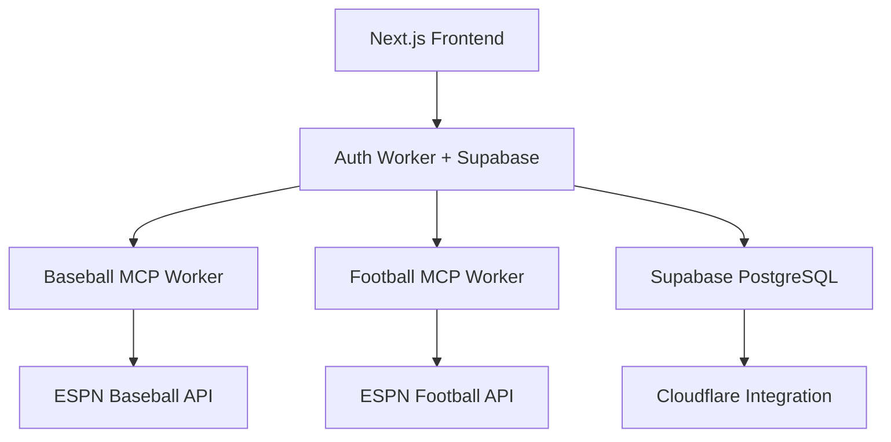

# KV to Supabase Conversion Guide

> **Status**: 85% Complete - Conversion functionally complete, deployment pending

## Overview

Converting FLAIM's credential storage from Cloudflare KV to Supabase PostgreSQL due to KV reliability issues (eventual consistency failures, encryption complexity, debugging difficulties).

**Key Discovery**: Cloudflare now offers **native Supabase integration** (2025) with OAuth2 setup and automatic credential injection.

## Implementation Status

### ✅ COMPLETED (Steps 1-4, 8)
- **Database Schema**: Supabase tables (`espn_credentials`, `espn_leagues`) with indexes
- **Storage Class**: `EspnSupabaseStorage` implementation (492 lines)
- **Auth Worker**: Complete KV replacement (714→492 lines, -31% code reduction)  
- **MCP Workers**: Both baseball/football updated to use auth-worker exclusively
- **Cleanup**: All KV dependencies removed, files archived, documentation updated

### 🔄 PENDING (Steps 5-7)
- **End-to-End Testing**: Requires real Supabase credentials
- **Preview Deployment**: Requires Cloudflare-Supabase integration setup
- **Production Deployment**: Final environment configuration

---

## Database Schema (Ready to Deploy)

```sql
-- Copy/paste into Supabase SQL Editor
CREATE TABLE espn_credentials (
  id UUID PRIMARY KEY DEFAULT gen_random_uuid(),
  clerk_user_id TEXT UNIQUE NOT NULL,
  swid TEXT NOT NULL,
  s2 TEXT NOT NULL,
  email TEXT,
  created_at TIMESTAMP WITH TIME ZONE DEFAULT NOW(),
  updated_at TIMESTAMP WITH TIME ZONE DEFAULT NOW()
);

CREATE TABLE espn_leagues (
  id UUID PRIMARY KEY DEFAULT gen_random_uuid(),
  clerk_user_id TEXT NOT NULL,
  league_id TEXT NOT NULL,
  sport TEXT NOT NULL CHECK (sport IN ('baseball', 'football', 'basketball', 'hockey')),
  team_id TEXT,
  team_name TEXT,
  league_name TEXT,
  season_year INTEGER,
  created_at TIMESTAMP WITH TIME ZONE DEFAULT NOW(),
  updated_at TIMESTAMP WITH TIME ZONE DEFAULT NOW(),
  
  UNIQUE(clerk_user_id, league_id, sport)
);

-- Indexes for performance
CREATE INDEX idx_espn_credentials_clerk_user_id ON espn_credentials(clerk_user_id);
CREATE INDEX idx_espn_leagues_clerk_user_id ON espn_leagues(clerk_user_id);
CREATE INDEX idx_espn_leagues_sport ON espn_leagues(sport);

-- Auto-update timestamps
CREATE OR REPLACE FUNCTION update_updated_at_column()
RETURNS TRIGGER AS $$
BEGIN
  NEW.updated_at = NOW();
  RETURN NEW;
END;
$$ language 'plpgsql';

CREATE TRIGGER update_espn_credentials_updated_at 
  BEFORE UPDATE ON espn_credentials 
  FOR EACH ROW EXECUTE FUNCTION update_updated_at_column();

CREATE TRIGGER update_espn_leagues_updated_at 
  BEFORE UPDATE ON espn_leagues 
  FOR EACH ROW EXECUTE FUNCTION update_updated_at_column();
```

---

## Completion Plan

### Phase 1: Supabase Setup 👤 USER ACTION (45 min)

**1.1 Create Supabase Project**
- Go to https://supabase.com/dashboard
- Create new project (choose region close to users)
- Copy project URL: `https://your-project-ref.supabase.co`

**1.2 Run Database Schema**
- Open Supabase SQL Editor
- Copy/paste schema above
- Test with sample data insertion

**1.3 Set Up Official Cloudflare Integration** ⭐ NEW
- Cloudflare Dashboard → Workers & Pages → auth-worker
- Settings → Integrations → Add Integration → Supabase
- Follow OAuth2 flow to connect your Supabase project
- Choose **Service Role Key** (for server-side operations)
- Integration auto-sets `SUPABASE_URL` and `SUPABASE_SERVICE_KEY` environment variables (use service role key for server-side operations)

### Phase 2: Update Configs 🤖 MY ACTION (30 min)

**2.1 Clean Up Wrangler Configs**
- Remove manual `SUPABASE_URL` placeholders from all wrangler.jsonc
- Add comments referencing official Cloudflare integration
- Update environment interface types

**2.2 Enhance Health Checks**
- Update auth-worker health endpoint for Supabase connectivity
- Add integration status to MCP worker health checks

**2.3 Update Documentation**
- Update README files with official integration setup
- Document OAuth2 integration process

### Phase 3: Testing 👤🤖 JOINT ACTION (30 min)

**3.1 Local Development**
- Set local environment variables for development:
  ```bash
  # .env.local in auth-worker (for local dev only)
  SUPABASE_URL=https://your-project-ref.supabase.co
  SUPABASE_SERVICE_KEY=your-service-role-key
  ```

**3.2 End-to-End Test**
- Start all services: `npm run dev`
- Test complete flow: Frontend → Auth-worker → MCP workers → ESPN API
- Verify data in Supabase dashboard
- Test error scenarios

### Phase 4: Deployment 👤 USER ACTION (30 min)

**4.1 Preview Environment**
- Set up Cloudflare-Supabase integration for preview environment
- Deploy: `npm run deploy:workers:preview`
- Test preview URLs

**4.2 Production Environment**
- Set up integration for production environment  
- Deploy: `npm run deploy:workers:prod`
- Monitor Supabase dashboard activity

---

## Key Benefits of New Approach

### Official Integration Advantages
✅ **Automated Credentials**: OAuth2 flow handles all credential injection  
✅ **Enhanced Security**: No manual secret management  
✅ **Simplified Setup**: Integration handles environment variables  
✅ **Better Monitoring**: Integration status visibility

### Technical Benefits Over KV
✅ **ACID Transactions**: No eventual consistency issues  
✅ **Rich Dashboard**: Visual debugging and data management  
✅ **Complex Queries**: SQL joins, filtering, aggregations  
✅ **Real-time**: Built-in subscriptions for live updates  
✅ **Scalability**: PostgreSQL handles much larger datasets

---

## Architecture Summary



**Current Implementation:**
- **Auth Worker**: 492 lines, Supabase-only storage
- **MCP Workers**: Stateless HTTP calls to auth-worker
- **Database**: PostgreSQL with proper indexes and constraints
- **Integration**: Ready for official Cloudflare-Supabase setup

---

## Next Steps

1. **👤 User**: Create Supabase project and set up official Cloudflare integration
2. **🤖 Assistant**: Update configurations for official integration
3. **👤🤖 Joint**: Test complete system end-to-end
4. **👤 User**: Deploy to preview and production environments

**Estimated Total Time**: ~2.5 hours to complete migration

The conversion is **85% complete** with zero KV dependencies remaining. Only deployment with official integration is needed to finish the migration.