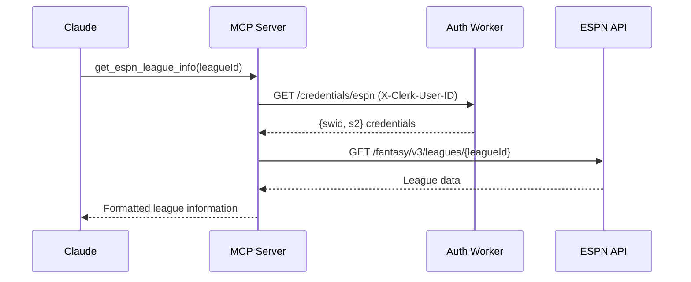

# MCP Integration Guide

> **Model Context Protocol (MCP)** integration for real-time ESPN fantasy sports data access

FLAIM implements dedicated **Model Context Protocol (MCP)** servers that provide Claude with direct access to your ESPN fantasy league data. This enables real-time analysis, strategic insights, and league management through natural language conversations.

## 🏗️ Architecture Overview

### MCP Server Infrastructure

FLAIM uses a **microservices architecture** with specialized Cloudflare Workers for each sport:

```
┌─────────────────┐    ┌─────────────────┐    ┌─────────────────┐
│   Auth Worker   │    │ Baseball MCP    │    │ Football MCP    │
│                 │    │    Server       │    │    Server       │
│ • Credentials   │◄──►│ • League Info   │    │ • League Info   │
│ • Leagues       │    │ • Rosters       │    │ • Rosters       │
│ • Encryption    │    │ • Matchups      │    │ • Matchups      │
│ • User Context  │    │ • Standings     │    │ • Standings     │
└─────────────────┘    └─────────────────┘    └─────────────────┘
         │                       │                       │
         └───────────────────────┼───────────────────────┘
                                 │
                    ┌─────────────────┐
                    │   Next.js App   │
                    │                 │
                    │ • UI/UX         │
                    │ • Authentication│
                    │ • MCP Config    │
                    │ • Chat Interface│
                    └─────────────────┘
```

### Core Components

1. **Auth Worker** - Centralized credential and league management
2. **Sport MCP Workers** - Specialized servers for each fantasy sport
3. **MCP Protocol** - Standardized tool execution and data access
4. **Claude Integration** - Natural language access to fantasy data

## 🔧 Available MCP Tools

### Baseball MCP Server (`baseball-espn-mcp`)

| Tool | Description | Parameters | Returns |
|------|-------------|------------|---------|
| `get_espn_league_info` | League settings and metadata | `leagueId` (required), `seasonId` (optional) | Complete league information with settings, standings, teams |
| `get_espn_team_roster` | Detailed team roster | `leagueId`, `teamId` (required), `seasonId` (optional) | Player roster with stats and status |
| `get_espn_matchups` | Current matchups | `leagueId` (required), `week`, `seasonId` (optional) | Matchup data with scores and projections |

### Football MCP Server (`football-espn-mcp`)

| Tool | Description | Parameters | Returns |
|------|-------------|------------|---------|
| `get_espn_football_league_info` | League settings and metadata | `leagueId` (required), `seasonId` (optional) | Football-specific league data with scoring |
| `get_espn_football_team` | Team information | `leagueId`, `teamId` (required), `seasonId`, `week` (optional) | Team roster and performance metrics |
| `get_espn_football_matchups` | Weekly matchups | `leagueId` (required), `week`, `seasonId` (optional) | Matchup data for specified week |
| `get_espn_football_standings` | League standings | `leagueId` (required), `seasonId` (optional) | Current league standings and rankings |

## 📡 MCP Protocol Implementation

### Standard MCP Endpoints

Each sport worker implements the full MCP protocol:

```
GET  /mcp                    # Server capabilities and metadata
GET  /mcp/tools/list         # Available tools with schemas
POST /mcp/tools/call         # Execute MCP tools with arguments
```

### Request/Response Format

```typescript
// MCP Tool Execution
interface McpToolCall {
  tool: string;                    // Tool name (e.g., "get_espn_league_info")
  arguments: Record<string, any>;  // Tool-specific parameters
}

// MCP Response
interface McpResponse {
  content: any;      // Tool execution results
  isError?: boolean; // Error status indicator
}
```

### Authentication Flow

```typescript
// 1. User authentication via Clerk
const userId = request.headers.get('X-Clerk-User-ID');

// 2. Credential retrieval from auth-worker
const credentials = await authWorker.getCredentials(userId, 'espn');

// 3. ESPN API access with user credentials
const espnClient = new EspnClient(credentials);
const data = await espnClient.getLeagueInfo(leagueId);
```

## 🔐 Security & Authentication

### Multi-Layer Security

1. **Clerk Authentication** - User identity verification
2. **Encrypted Storage** - AES-GCM encryption in Cloudflare KV
3. **User Isolation** - Each user's data is completely isolated
4. **Internal Communication** - Secure worker-to-worker API calls

### Credential Management

```typescript
// Credential Storage (Auth Worker)
interface EspnCredentials {
  swid: string;        // ESPN SWID cookie
  s2: string;          // ESPN S2 authentication cookie
  userId: string;      // Clerk user ID
  createdAt: Date;     // Credential creation timestamp
  updatedAt: Date;     // Last update timestamp
}

// League Association
interface UserLeague {
  leagueId: string;    // ESPN league ID
  sport: string;       // Sport type (baseball, football, etc.)
  teamId?: string;     // User's team ID in the league
  leagueName?: string; // Display name for the league
}
```

## 🎯 Integration Examples

### Claude Conversation Examples

**League Analysis:**
```
User: "How is my fantasy baseball team performing this week?"

Claude: I'll check your current matchup and team performance.
[Executes: get_espn_matchups, get_espn_team_roster]

Your team is projected to win 7-3 this week! Your starting pitchers 
are performing well, with a combined 2.1 ERA. However, your outfield 
could use some attention - consider checking the waiver wire for OF options.
```

**Strategic Advice:**
```
User: "Should I start Player X or Player Y at flex this week?"

Claude: Let me analyze both players' matchups and projections.
[Executes: get_espn_football_team, get_espn_football_matchups]

Based on this week's matchups, I recommend starting Player X. He's 
facing a defense ranked 28th against RBs, while Player Y is up against 
the #3 defense. Player X is projected for 12.4 points vs Player Y's 8.1.
```

### Programmatic Integration

```typescript
// MCP Client Configuration
const mcpConfig = {
  server_label: "flaim-football",
  server_url: "https://football-espn-mcp.your-account.workers.dev/mcp",
  allowed_tools: "get_espn_football_league_info,get_espn_football_team,get_espn_football_matchups,get_espn_football_standings",
  skip_approval: false
};

// Tool Execution
const result = await mcpClient.callTool({
  tool: "get_espn_football_league_info",
  arguments: {
    leagueId: "123456789",
    seasonId: "2024"
  }
});
```

## 🚀 Setup & Configuration

### 1. Deploy MCP Workers

```bash
# Deploy auth worker first
cd workers/auth-worker
wrangler deploy --env prod

# Deploy sport workers
cd workers/baseball-espn-mcp
wrangler deploy --env prod

cd workers/football-espn-mcp
wrangler deploy --env prod
```

### 2. Configure MCP Client

In your AI assistant (Claude Desktop, VS Code, etc.):

```json
{
  "mcpServers": {
    "flaim-baseball": {
      "command": "npx",
      "args": ["-y", "@flaim/mcp-baseball-client"],
      "env": {
        "FLAIM_MCP_URL": "https://baseball-espn-mcp.your-account.workers.dev/mcp",
        "FLAIM_AUTH_URL": "https://auth-worker.your-account.workers.dev"
      }
    },
    "flaim-football": {
      "command": "npx", 
      "args": ["-y", "@flaim/mcp-football-client"],
      "env": {
        "FLAIM_MCP_URL": "https://football-espn-mcp.your-account.workers.dev/mcp",
        "FLAIM_AUTH_URL": "https://auth-worker.your-account.workers.dev"
      }
    }
  }
}
```

### 3. Environment Variables

```bash
# Auth Worker
ENCRYPTION_KEY=your-32-char-base64-key
CLERK_SECRET_KEY=sk_live_your-clerk-secret
CF_KV_CREDENTIALS=your-kv-namespace-id

# MCP Workers
AUTH_WORKER_URL=https://auth-worker.your-account.workers.dev
NEXT_PUBLIC_BASEBALL_MCP_URL=https://baseball-espn-mcp.your-account.workers.dev
NEXT_PUBLIC_FOOTBALL_MCP_URL=https://football-espn-mcp.your-account.workers.dev
```

## 🔍 Data Access Patterns

### Real-Time Data Flow



### Error Handling

```typescript
// Graceful error handling with user-friendly messages
try {
  const data = await mcpTool.execute();
  return { content: data, isError: false };
} catch (error) {
  if (error.status === 401) {
    return { 
      content: "Please re-authenticate with ESPN in your FLAIM settings.",
      isError: true 
    };
  }
  // ... other error cases
}
```

## 📊 Performance & Caching

### Caching Strategy

- **League Data**: Cached for 1 hour (relatively static)
- **Matchup Data**: Cached for 15 minutes (updated frequently)
- **Roster Data**: Cached for 5 minutes (real-time updates)
- **Credentials**: Cached for 24 hours (security balance)

### Rate Limiting

- **ESPN API**: 100 requests/minute per user
- **MCP Tools**: No internal rate limiting (ESPN API is the bottleneck)
- **Auth Worker**: 1000 requests/minute per user

## 🐛 Troubleshooting

### Common Issues

**"MCP server not found"**
```bash
# Check worker deployment status
wrangler deployments list

# Verify worker is responding
curl https://baseball-espn-mcp.your-account.workers.dev/mcp
```

**"Authentication failed"**
```bash
# Check auth worker configuration
curl -H "X-Clerk-User-ID: your-user-id" \
  https://auth-worker.your-account.workers.dev/credentials/espn
```

**"No leagues found"**
```bash
# Verify league association
curl -H "X-Clerk-User-ID: your-user-id" \
  https://auth-worker.your-account.workers.dev/leagues
```

### Debug Mode

Enable debug logging in development:

```typescript
// In your MCP worker
const DEBUG = env.NODE_ENV === 'development';
if (DEBUG) {
  console.log('MCP Tool Call:', { tool, arguments });
  console.log('ESPN API Response:', response);
}
```

## 🎭 Multi-Sport Expansion

### Adding New Sports

1. **Create Sport Worker**:
   ```bash
   mkdir workers/basketball-espn-mcp
   cp -r workers/football-espn-mcp/* workers/basketball-espn-mcp/
   ```

2. **Update ESPN Game IDs**:
   ```typescript
   const ESPN_GAME_IDS = {
     'ffl': 'football',
     'flb': 'baseball', 
     'fba': 'basketball',  // Add new sport
     'fhl': 'hockey'
   };
   ```

3. **Implement Sport-Specific Tools**:
   ```typescript
   // Basketball-specific tools
   tools: [
     'get_espn_basketball_league_info',
     'get_espn_basketball_team',
     'get_espn_basketball_matchups',
     'get_espn_basketball_standings'
   ]
   ```

### Supported Sports

- ✅ **Baseball** (`flb`) - Full implementation
- ✅ **Football** (`ffl`) - Full implementation  
- 🚧 **Basketball** (`fba`) - Framework ready
- 🚧 **Hockey** (`fhl`) - Framework ready
- 🚧 **Soccer** (`fso`) - Framework ready

## 🤝 Contributing

### Development Setup

```bash
# Clone repository
git clone https://github.com/yourusername/flaim
cd flaim

# Install dependencies
npm install

# Start development servers
npm run dev:workers  # All workers in parallel
npm run dev:app      # Next.js application
```

### Testing MCP Integration

```bash
# Unit tests
npm run test:workers

# Integration tests
npm run test:mcp

# End-to-end tests
npm run test:e2e
```

---

**Need help?** Check the [FAQ](FAQ.md) or [open an issue](https://github.com/yourusername/flaim/issues) for MCP-specific questions.